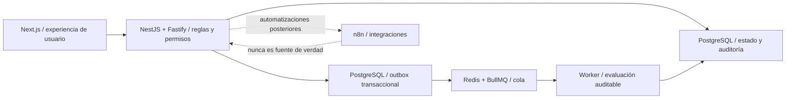

# Fundación backend de I HERE

## Decisión arquitectónica

I HERE comienza como un monolito modular. Esta forma mantiene una sola fuente de verdad y permite separar dominios sin introducir desde ahora la complejidad operativa de microservicios.



El backend y PostgreSQL controlan estados, permisos, versiones, decisiones, idempotencia y auditoría. Redis y BullMQ transportan los trabajos de evaluación; un outbox en PostgreSQL evita perder solicitudes entre la transacción editorial y la cola. n8n se incorporará después para correo, Drive, alertas y tareas programadas; no decidirá estados editoriales.

## Módulos implementados

- `auth`: login por alias DNI protegido, JWT corto, refresh token opaco rotativo y cierre de sesión revocable.
- `identity`: creación interna de usuarios con Argon2id; no existe registro público.
- `clients`: consulta aislada por organización y por asignaciones de cliente.
- `titles`: propuestas, versiones, correcciones, outbox, evaluación automática, duplicidad textual, decisiones humanas y controles de transición.
- `notes`: creación desde título aprobado, brief congelado, contenido estructurado seguro y versiones inmutables.
- `audit`: bitácora con actor, entidad, antes/después, IP, agente de usuario y `requestId`.
- `health`: comprobaciones separadas de proceso y disponibilidad de PostgreSQL.
- `database`: Prisma 7 mediante adaptador PostgreSQL.

## Modelo de seguridad

1. Cada persona posee un UUID interno. El DNI se normaliza y convierte con HMAC-SHA-256 y un `pepper`; no se almacena el número en texto plano.
2. La contraseña se almacena con Argon2id. El DNI nunca funciona como contraseña ni como único factor de seguridad.
3. El access token dura pocos minutos. El refresh token es aleatorio, se guarda únicamente como hash, rota al usarlo y viaja en cookie `HttpOnly` con `SameSite=Strict`.
4. Los permisos se asignan a nivel de organización o a clientes específicos. Cada consulta vuelve a filtrar por `tenantId`; no confía solo en el token.
5. No hay autorregistro. El primer administrador se crea explícitamente mediante variables de entorno durante el seed.
6. CORS usa lista permitida, las entradas se validan, las rutas se limitan por frecuencia y las cabeceras se endurecen con Helmet.
7. Toda acción crítica conserva auditoría. Las decisiones de aprobación siguen siendo humanas.

La bandera `mfaRequired` ya forma parte del usuario, pero MFA no se anuncia como activo hasta integrar y probar un segundo factor real.

## Flujo persistido de títulos

```text
DRAFT -> PROPOSED -> EVALUATING -> APPROVED -> USED
                    |          |
                    |          -> REJECTED
                    -> CHANGES_REQUESTED -> PROPOSED
```

- Aprobar exige evaluación completada, sin veredicto de bloqueo y con 80 puntos o más.
- Una similitud de 75 o más bloquea la aprobación mientras la duplicidad siga pendiente.
- Los estados aprobados, rechazados o utilizados no se editan silenciosamente.
- Cada corrección guarda campo, valor anterior, valor nuevo, motivo, clasificación, usuario y fecha.
- Una corrección puede sugerir una regla, pero solo una persona autorizada puede activar esa regla.
- Los resultados de agentes guardan conclusiones estructuradas, evidencia, métricas de ejecución y costo; no razonamientos privados.

## Ejecución de evaluaciones

1. La solicitud y el trabajo de outbox se crean dentro de la misma transacción de PostgreSQL.
2. El despachador reclama trabajos pendientes y los publica en BullMQ con un identificador estable.
3. El worker compara el título con el historial del mismo cliente, aplica la rúbrica editorial y persiste cuatro resultados estructurados.
4. Un trabajo repetido no duplica resultados: la evaluación completada es idempotente y el identificador de BullMQ deriva del outbox.
5. Los fallos se reintentan hasta tres veces con espera exponencial. Si se agotan, la evaluación queda fallida y la propuesta vuelve a un estado recuperable.
6. Al iniciar, el despachador recupera evaluaciones antiguas que hubieran quedado en cola o ejecución.

La evaluación actual usa `title-similarity-v1` e `ihere-editorial-rubric-v1`. No es un proveedor de IA y no se etiqueta como tal. La similitud semántica se añadirá en una versión posterior.

## Entorno local

`infra/compose.yaml` levanta PostgreSQL 17 en el puerto `54329` y Redis 7 en `63799`, ambos con healthchecks y volúmenes persistentes.

```bash
pnpm dev:infra
pnpm db:generate
pnpm db:migrate
pnpm db:seed
pnpm dev:api
```

Antes del seed debe existir `apps/api/.env`, creado desde `.env.example`. Los valores `replace-with...` son marcadores y deben sustituirse. Si no se indican ambas variables de bootstrap, el seed crea organización, cliente, permisos y rol, pero no crea ninguna cuenta.

## Contrato inicial

- `GET /api/v1/health/live`
- `GET /api/v1/health/ready`
- `POST /api/v1/auth/login`
- `POST /api/v1/auth/refresh`
- `POST /api/v1/auth/logout`
- `GET /api/v1/auth/me`
- `GET /api/v1/clients`
- `GET|POST /api/v1/titles`
- `GET|PATCH /api/v1/titles/:id`
- `POST /api/v1/titles/:id/submit`
- `POST /api/v1/titles/:id/evaluations`
- `POST /api/v1/titles/:id/decisions`
- `GET|POST /api/v1/notes`
- `GET|PATCH /api/v1/notes/:id`

Swagger está disponible en `http://localhost:4100/api/v1/docs` durante el desarrollo.

## Integración web completada

- Next.js usa login, refresh y logout reales. El access token se conserva únicamente en memoria y el refresh token permanece en cookie `HttpOnly`.
- Los clientes, propuestas, versiones, evaluaciones, decisiones e historial provienen del API y PostgreSQL.
- La interfaz conserva estados de carga, error, vacío y reintento, actualiza las evaluaciones activas cada 2.5 segundos y muestra únicamente resultados persistidos.

## Siguientes integraciones

1. Añadir duplicidad semántica con evidencia y umbrales calibrados sobre el historial aprobado.
2. Incorporar un proveedor generativo con presupuesto, fuentes, trazabilidad y revisión humana para proponer títulos; las reglas actuales seguirán siendo una capa independiente de QA.
3. Completar sobre la fundación existente la interfaz de notas, QA, aprobación y exportación; después, construir el portal analítico GA4/GSC.

No se configurarán proveedor de IA, GitHub privado, VPS, GA4, Search Console, MFA ni plantillas oficiales hasta contar con las credenciales y decisiones del propietario.
