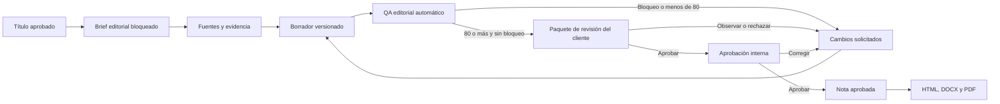

# I HERE - Flujo automatizado de notas

## Resultado esperado

Convertir un título aprobado en una nota trazable, versionada y lista para entrega. La automatización puede preparar borradores y ejecutar QA, pero una persona autorizada conserva la aprobación editorial y la decisión de exportar.

## Recorrido completo

## Estados

| Estado              | Significado                                                  | Quién puede avanzar                                                 |
| ------------------- | ------------------------------------------------------------ | ------------------------------------------------------------------- |
| `DRAFT`             | Existe una versión editable.                                 | Redactor autorizado o automatización.                               |
| `GENERATING`        | Un trabajo prepara una nueva versión.                        | Worker.                                                             |
| `QA_QUEUED`         | La versión está lista para evaluación.                       | Sistema.                                                            |
| `QA_RUNNING`        | Se están ejecutando validaciones.                            | Worker.                                                             |
| `CHANGES_REQUESTED` | QA o una persona detectaron ajustes.                         | Editor.                                                             |
| `READY_FOR_REVIEW`  | Superó QA con 80 o más y sin bloqueo crítico.                | Revisor humano.                                                     |
| `APPROVED`          | La versión vigente fue aprobada.                             | Usuario con permiso de aprobación.                                  |
| `REJECTED`          | La nota fue descartada con motivo.                           | Revisor humano.                                                     |
| `EXPORTED`          | Existe al menos una entrega generada de la versión aprobada. | Un editor autorizado puede abrir una corrección como versión nueva. |
| `ARCHIVED`          | El expediente dejó de estar activo.                          | Administrador.                                                      |

Una versión anterior nunca se sobrescribe. Si cambia contenido después del QA o de una aprobación, se crea una nueva versión y se invalidan los resultados anteriores.

### Corrección posterior a una entrega

Una nota `EXPORTED` puede recibir una corrección editorial, pero la entrega no se reabre ni se modifica. Al guardar el cambio, I HERE realiza una única operación transaccional:

- conserva intactas la versión aprobada y todas sus exportaciones históricas;
- crea la versión siguiente con estado `DRAFT` y elimina la aprobación únicamente de la versión vigente del expediente;
- revoca los enlaces de revisión anteriores, incluso si ya registraron una decisión, sin borrar esa decisión histórica;
- registra el motivo, el tipo de corrección, los campos modificados y cuántos enlaces fueron revocados.

La versión nueva debe recorrer nuevamente QA, revisión del cliente, aprobación humana y exportación. Los archivos anteriores continúan disponibles para consulta y descarga autorizada.

## Brief bloqueado desde el título

Al crear la nota se toma una copia operativa e inmutable del título aprobado y de su contexto:

- título y slug;
- objetivo;
- público;
- intención de búsqueda;
- enfoque;
- oportunidad;
- riesgo editorial;
- pregunta principal y contrato de respuesta temprana para AEO;
- estructura orientativa H2/H3, ejemplo o escenario y conclusión esperada;
- plan de evidencia, prioridad de fuentes y aporte original que debe confirmar Adecco;
- separación entre título editorial, H1, título SEO, slug y metadescripción;
- servicio, CTA y enlaces internos pendientes de confirmación;
- límites legales, institucionales y de promesas;
- cliente, fecha y usuario responsable.

La copia evita que una modificación posterior del módulo de títulos altere silenciosamente una nota ya iniciada.

## Paquete mensual para el cliente

Las notas listas para revisión se comparten como un expediente único, no como enlaces sueltos. El portal público presenta una nota a la vez y permite desplazarse entre `Nota 1`, `Nota 2`, etc. Para cada nota el destinatario debe registrar una decisión independiente:

- aprobar sin comentario obligatorio;
- observar indicando el ajuste requerido;
- rechazar explicando el motivo.

El paquete muestra el avance, los estados individuales y el contenido completo que se aprobará. No puede enviarse mientras falte revisar alguna nota. La respuesta queda asociada a la versión exacta; si el equipo crea una versión nueva, el enlace anterior se revoca y se conserva como evidencia histórica. La aprobación del cliente no reemplaza la aprobación interna: habilita al responsable editorial para cerrarla. En un reenvío, las versiones ya aprobadas por el cliente quedan fuera y solo se comparten las pendientes o corregidas.

El enlace usa un token no almacenado en texto plano, puede vencer, limitar sus vistas y revocarse. Si la ventana se cierra, el responsable autorizado puede recuperar desde el historial el enlace activo sin crear otra invitación.

## Contenido versionado

Cada versión conserva:

- título visible, meta title, meta description y slug;
- extracto y cuerpo estructurado;
- autor o especialista atribuido;
- CTA y enlaces internos propuestos;
- fuentes con URL, entidad, fecha, tipo y fecha de consulta;
- motivo del cambio y procedencia: humana, asistida, importada o del sistema;
- conteo de palabras y huella digital del contenido;
- usuario, fecha y versión.

También conserva su propuesta visual: concepto, instrucciones de producción, texto alternativo, pie sugerido, referencia opcional y estado de aprobación. Editar la nota o generar una versión nueva no hace pasar automáticamente una propuesta visual anterior como aprobada.

### Revisión de la propuesta visual

Antes de compartir o publicar, el equipo puede editar y decidir la propuesta visual de la versión vigente. El cliente ve esa propuesta junto con la nota para evaluar si representa correctamente el servicio y el contexto. Las decisiones posibles son aprobación, solicitud de cambios o rechazo, siempre con trazabilidad. La URL de referencia es orientativa: no sustituye la producción, licencia y carga del activo definitivo.

El cuerpo se almacenará como bloques estructurados, no como HTML libre. El HTML será una salida generada y saneada. Esto permite crear DOCX, PDF y HTML desde la misma fuente sin perder jerarquías, listas, citas o enlaces.

## QA automático

Para Adecco Perú, el QA general se complementa con el estándar específico de [marca, servicios y evidencia](./adecco-editorial-standards.md). Las reglas del cliente solo influyen en una generación cuando están activas y conservan aprobación humana.

La rúbrica mantiene 100 puntos:

| Dimensión                | Puntos | Comprobación                                                      |
| ------------------------ | -----: | ----------------------------------------------------------------- |
| Intención y utilidad     |     20 | Respuesta temprana, cobertura y utilidad para la consulta.        |
| Originalidad y evidencia |     20 | Aporte propio, fuentes y afirmaciones verificables.               |
| Organización y claridad  |     15 | Jerarquía, lectura natural y secciones coherentes.                |
| SEO editorial            |     15 | Metadatos, encabezados, enlaces e intención.                      |
| GEO, AEO y citabilidad   |     15 | Entidades, contexto, atribución y respuestas directas.            |
| Orientación a la acción  |     10 | CTA útil y proporcional a la intención.                           |
| Calidad final            |      5 | Sin pendientes, marcadores, enlaces rotos ni defectos de entrega. |

Son bloqueos críticos:

- información inventada o no sustentada;
- afirmaciones normativas sin fuente primaria;
- datos pendientes o marcadores como “completar luego”;
- fuente inexistente o atribuida de forma incorrecta;
- duplicación temática sin decisión registrada;
- contenido vacío o estructura inválida;
- ausencia de revisión humana antes de aprobar.

El flujo editorial actual también bloquea notas con menos de 700 palabras útiles, garantías absolutas de resultados o cumplimiento y afirmaciones de desempeño atribuidas a automatización cuando no existe ninguna fuente registrada. El objetivo habitual de redacción es de 1,200 a 1,800 palabras cuando la complejidad lo justifique; no se presenta como un factor de posicionamiento ni justifica añadir relleno.

El sistema registra resultados por especialidad, evidencia utilizada, reglas, proveedor y versión de modelo si existiera, duración, tokens y costo. No muestra razonamientos privados.

## Correcciones y aprendizaje

Toda edición posterior a una generación o QA debe conservar campo, antes, después, motivo y tipo de corrección. Las correcciones recurrentes pueden convertirse en reglas candidatas, pero solo una persona autorizada puede activarlas. El sistema aprende de decisiones estructuradas; no modifica prompts o reglas en producción por sí solo.

## Exportaciones

- Solo se exporta la versión aprobada.
- Cada archivo registra formato, versión, huella digital, usuario y fecha.
- Una nueva versión aprobada genera una nueva entrega; no reemplaza silenciosamente archivos anteriores.
- El HTML se sanea y respeta la plantilla del cliente.
- DOCX y PDF se renderizan y verifican visualmente antes de declararse válidos.

## Pantallas del submódulo

1. `Notas / Bandeja`: cliente, etapa, responsable, QA, fecha y búsqueda.
2. `Notas / Editor`: brief, estructura, contenido, fuentes y metadatos.
3. `Notas / QA`: puntajes, bloqueos, hallazgos y evidencia.
4. `Notas / Editor`: comparación de versiones y decisión humana cuando la nota está lista para revisión.
5. `Notas / Exportaciones`: archivos, versión, fecha, huella y descarga.

En móvil se priorizan estado, bloqueos y acciones; la edición extensa usa secciones plegables. En laptop se usa un editor central con panel lateral. En pantallas grandes se muestran brief, contenido y QA en tres zonas sin ampliar artificialmente la tipografía.

## Límites de la primera implementación

La estructura, permisos, versiones, QA determinista, auditoría y exportación pueden construirse sin un proveedor generativo. La generación automática real se activa únicamente después de configurar credenciales, modelos permitidos, presupuesto, límites, política de fuentes y tratamiento de datos. Mientras eso no exista, I HERE no presentará texto de ejemplo como contenido generado.

## Criterios de aceptación

- Solo un título `APPROVED` puede iniciar una nota.
- El título pasa a `USED` dentro de la misma transacción que crea la nota.
- No se puede editar una versión aprobada; cualquier cambio crea otra versión.
- Una corrección de una nota `EXPORTED` crea una versión `DRAFT`, revoca enlaces previos y conserva sin cambios la versión y los archivos entregados.
- Un paquete de revisión contiene notas del mismo cliente y expediente, todas en `READY_FOR_REVIEW`, y exige una decisión vigente por cada nota.
- Una decisión del paquete solo afecta la versión incluida en la invitación; nunca aprueba silenciosamente una versión posterior.
- La propuesta visual pertenece a una versión concreta y conserva edición, decisión y motivo auditables.
- QA pertenece a una versión exacta y queda obsoleto si aparece una versión nueva.
- Menos de 80 puntos o un bloqueo crítico impiden aprobar.
- Aprobar, rechazar, solicitar cambios y exportar requieren motivo o evento auditable.
- Ningún contenido o resultado se identifica como IA si no proviene realmente de un proveedor registrado.
- Los trabajos son idempotentes, reintentables y recuperables después de un reinicio.
- El aislamiento por organización y cliente se aplica en cada consulta.
